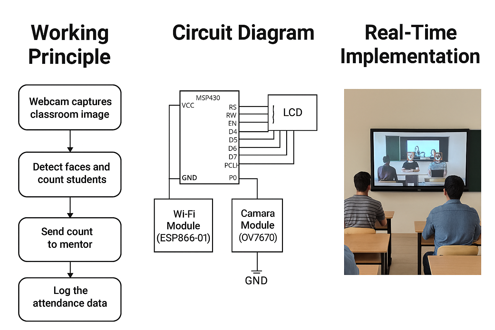

# Smart-Class-Attendance-System
The Smart Class Attendance System automates attendance using a webcam on the smart board. It detects and recognizes student faces in real time, counts unique individuals per period, logs data with timestamps, and notifies mentors via email or SMS. This ensures accurate, efficient, and seamless attendance tracking.
Project Visuals
🧠 Working Principle

This diagram illustrates how the system captures classroom video, detects and recognizes faces, counts students, logs attendance, and notifies the mentor.

🔌 Circuit Diagram!
[alt text](Copilot_20260108_104150.png)

This schematic shows the hardware setup including webcam, microcontroller (e.g., Raspberry Pi), and connections to the smart board and database.

🏫 Real-Time Implementation

A snapshot of the system in action: students seated in a classroom, webcam capturing video, smart board displaying detected faces, and mentor receiving attendance updates.

🔄 Workflow Diagram

A step-by-step flowchart of the Smart Class Attendance System from video capture to mentor notification.

📊 Dashboard (Optional)

An optional dashboard interface showing attendance trends, student logs, and period-wise summaries.